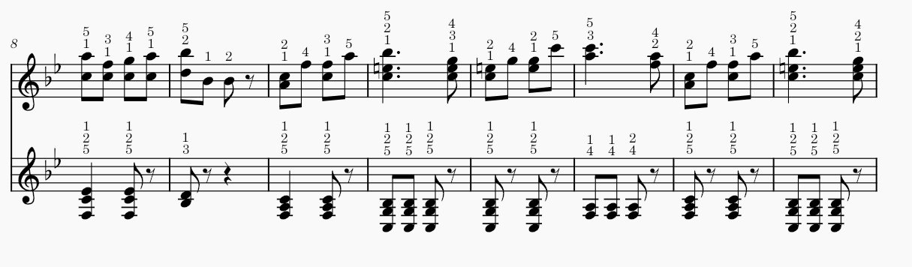
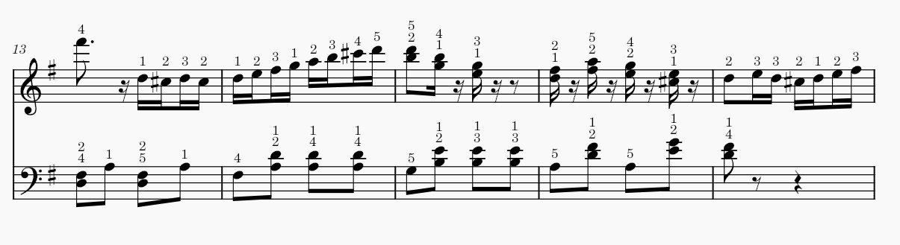
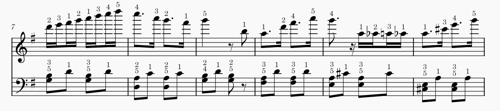
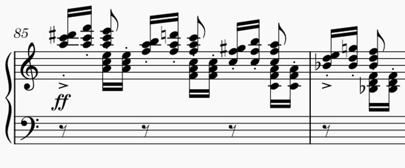

# Automatic generation of the piano fingering

## Introduction

The automatic generation of piano fingerings is an essential topic in the field of music and artificial intelligence. Correct fingering can significantly improve a pianist's ability to play pieces efficiently and comfortably, especially for beginners. Automatic fingering systems aim to assist pianists by generating optimal finger sequences for each hand, based on the notes in a musical piece.

## The PIG dataset

The [**PIG** dataset](https://beam.kisarazu.ac.jp/~saito/research/PianoFingeringDataset/) is a unique and invaluable resource for piano fingering. It contains detailed information about musical pieces, including note sequences and the corresponding fingerings for both hands.

The dataset includes musical scores in PDF format and one or more fingering text files for each score. A fingering file contains a list of musical notes, with each note described by the following:

* (note ID) (onset time) (offset time) (spelled pitch) (onset velocity) (offset velocity) (channel) (finger number)

## Outcome

The goal of this project is to generate optimal fingerings for piano pieces automatically. Below is an example of a musical score output with generated fingering:

---

## Usage

To generate fingering for a custom musical piece, follow these steps:

1. Place your `.mxl`, `.xml` files into the `music_files/` directory.
2. Run the `automatic-fingering-testing.ipynb`, selecting either the GRU or LSTM model.
3. The resulting score with fingering will be saved to the `data/annotated_mxl/` folder.

---

## Experiments

A comprehensive set of experiments was conducted to explore the influence of:

* different input features,
* hyperparameters (e.g., number of layers, hidden units),
* attention mechanisms,
* and variations in dataset composition (original, augmented, and custom data).

All experimental logs and results are stored under `models/experiments`.

### Key findings:

* **Feature importance:** `intervals` outperformed `midiValue` as a primary input feature.
* **Best architectures:** Bi-GRU (3 layers, 16 units) and Bi-LSTM (2 layers, 64 units) provided the best results.
* **Attention mechanism:** Did not improve accuracy; performance slightly degraded.
* **Dataset augmentation:** Transposition led to overfitting due to fixed fingerings across melodies.
* **Custom datasets:** Reduced model accuracy due to their limited complexity.

---

## Limitations

Despite promising results, the current system has the following limitations:

* It does not work on musical pieces where the number of notes for either hand is fewer than **11**, due to sequence length requirements.
* In cases where both hands play simultaneously on the same staff (e.g., overlapping voices), the system treats the input as a single melody. This often leads to **incorrect fingerings**.

* The **last five notes** of any piece are not assigned fingerings, since prediction is done only for the central note in a moving sliding window.

## Future Work:

This system, built upon bidirectional recurrent neural networks, has demonstrated the ability to automatically generate piano fingerings. While results are promising, further work is needed to improve performance in challenging musical scenarios — particularly in reducing errors such as **hop**, **smear**, **crossed chord**, and **thumbless cross**. Enhancements will focus on refining sequence handling and adapting the model to more complex musical textures.

---
