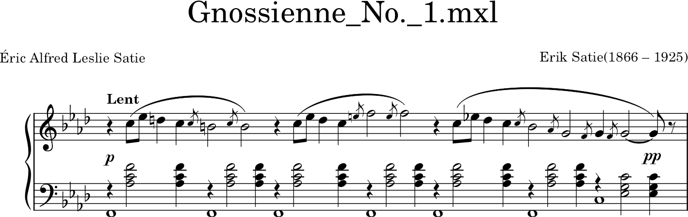
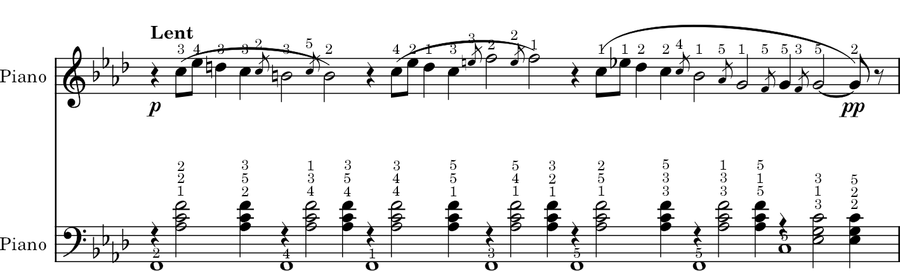

# Automatic Generation of the Fingers for the Piano

## Introduction
The automatic generation of piano fingerings is an essential topic in the field of music and artificial intelligence. Correct fingering can significantly improve a pianist's ability to play pieces efficiently and comfortably, especially for beginners. Automatic fingering systems aim to assist pianists by generating 
optimal finger sequences for each hand, based on the notes in a musical piece.

## Current Progress

Currently, I have developed a BiLSTM-based architecture. There is a need for two separate networks for the left and right hands. At this stage, the model for the right hand is implemented, while the left-hand model is still in progress.

## The PIG Dataset
The [**PIG** dataset](https://beam.kisarazu.ac.jp/~saito/research/PianoFingeringDataset/) is a unique and invaluable resource for piano fingering. It contains detailed information about musical pieces, including note sequences and the corresponding fingerings both hands. 

The dataset contains musical scores in PDF and one or more fingering files in the text format for each musical score. A fingering file is a list of musical notes and each
note (corresponding to each line of the file) has the following information:
- (note ID) (onset time) (offset time) (spelled pitch) (onset velocity) (offset velocity)
(channel) (finger number) 

## Expected Outcome  
The goal of this project is to generate optimal fingerings for piano pieces automatically. Below is an example of a musical score without fingering (top) and the output with generated fingering (bottom).  

 

 

**_Note:_** The fingering on the bottom image is **illustrative and randomly generated**, so it does not represent an optimal fingering.

## Future Work
Moving forward, the next steps include:

- [ ] Collect more musical pieces, as the initial dataset is insufficient.  
- [ ] Fine-tune the model on new pieces with additional input features extracted from `.xml` files.  
- [ ] Implement a model for the left hand.  
- [ ] Explore alternative model architectures.